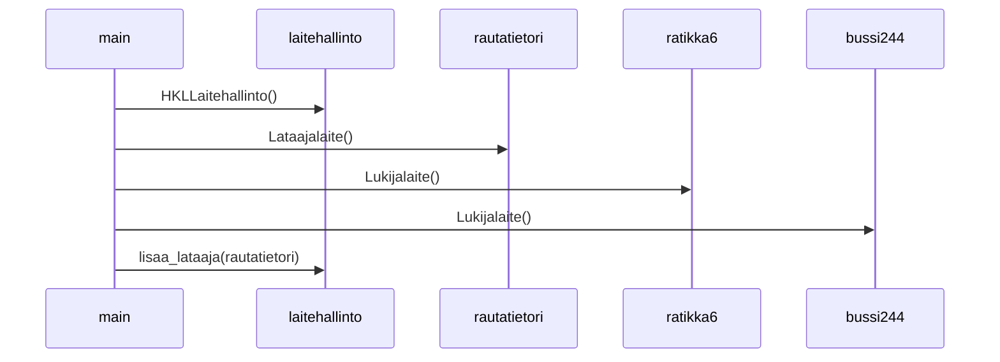

## HSL-matkakortti, sekvenssikaavio

```mermaid
sequenceDiagram
    participant main
    participant laitehallinto
    participant rautatietori
    participant ratikka6
    participant bussi244

    main->>laitehallinto: HKLLaitehallinto()
    main->>rautatietori: Lataajalaite()
    main->>ratikka6: Lukijalaite()
    main->>bussi244: Lukijalaite()

    main->>laitehallinto: lisaa_lataaja(rautatietori)


```
