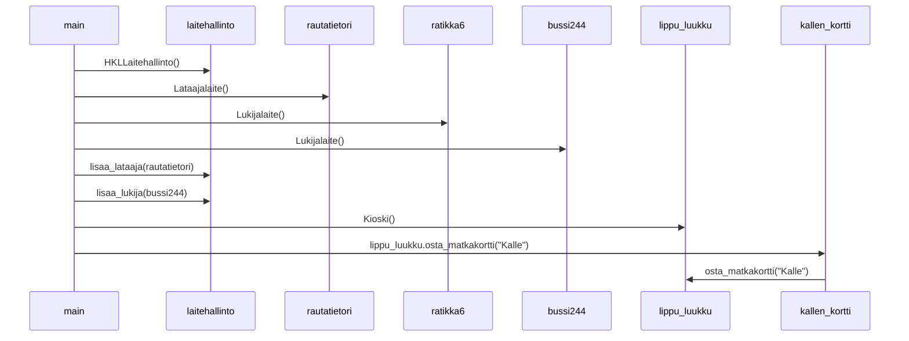

## HSL-matkakortti, sekvenssikaavio

```mermaid
sequenceDiagram
    participant main
    participant laitehallinto
    participant rautatietori
    participant ratikka6
    participant bussi244
    participant lippu_luukku
    participant kallen_kortti

    main->>laitehallinto: HKLLaitehallinto()
    main->>rautatietori: Lataajalaite()
    main->>ratikka6: Lukijalaite()
    main->>bussi244: Lukijalaite()

    main->>laitehallinto: lisaa_lataaja(rautatietori)
    main->>laitehallinto: lisaa_lukija(bussi244)
    main->>lippu_luukku: Kioski()
    main->>kallen_kortti: lippu_luukku.osta_matkakortti("Kalle")
    kallen_kortti->>lippu_luukku: osta_matkakortti("Kalle")


```
