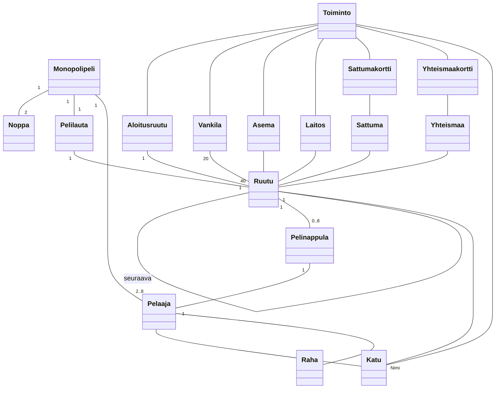

## Monopoli, luokkakaavio

```mermaid
 classDiagram
    Monopolipeli "1" -- "2" Noppa
    Monopolipeli "1" -- "1" Pelilauta
    Pelilauta "1" -- "40" Ruutu
    Ruutu "1" -- "1" Ruutu : seuraava
    Ruutu "1" -- "0..8" Pelinappula
    Pelinappula "1" -- "1" Pelaaja
    Pelaaja "2..8" -- "1" Monopolipeli
    Aloitusruutu "1" -- Ruutu
    Vankila "20" -- Ruutu
    Sattuma -- Ruutu
    Yhteismaa -- Ruutu
    Asema -- Ruutu
    Laitos -- Ruutu
    Katu "Nimi" -- Ruutu
    Sattumakortti -- Sattuma
    Yhteismaakortti -- Yhteismaa
    Pelaaja -- Katu
    Pelaaja -- Raha
    Toiminto -- Aloitusruutu
    Toiminto -- Vankila
    Toiminto -- Asema
    Toiminto -- Laitos
    Toiminto -- Sattumakortti
    Toiminto -- Yhteismaakortti
    Toiminto -- Katu


```
